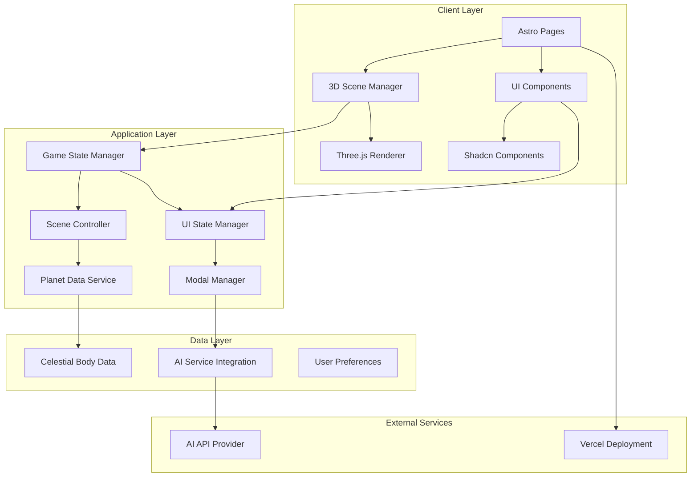

# Design Document

## Overview

The Space Exploration Learning Game is a web-based 3D educational application that combines immersive visualization with AI-powered learning. Built on Astro's server-side rendering capabilities and Three.js 3D graphics, the application provides an interactive solar system experience where users can explore celestial bodies, access educational content, and engage with an AI chatbot for deeper learning.

The architecture leverages modern web technologies to deliver fast initial page loads through Astro's SSR, smooth 3D interactions via Three.js, and a responsive UI built with Shadcn components. The system is designed for extensibility to support multiple planetary systems in future iterations.

## Architecture

### High-Level Architecture



### Technology Stack Integration

- **Astro**: Server-side rendering for fast initial loads and SEO optimization
- **Three.js**: 3D rendering engine for solar system visualization
- **Shadcn**: Consistent, accessible UI component library
- **Vercel**: Deployment platform with edge optimization
- **TypeScript**: Type safety across the application

## Components and Interfaces

### Core Components

#### 1. Main Menu Component (`MainMenu.tsx`)

- **Purpose**: Entry point for user navigation
- **Props**: None
- **State**: Menu selection state
- **Interactions**:
  - Start Game button → Navigate to Solar System view
  - Settings button → Open settings modal
  - Exit/About options

#### 2. Solar System Scene Component (`SolarSystemScene.astro`)

- **Purpose**: Main 3D visualization container
- **Props**:
  - `initialCameraPosition?: Vector3`
  - `enableControls?: boolean`
- **State**:
  - Camera position and orientation
  - Selected celestial body
  - Zoom level
  - Loading state
- **Interactions**:
  - Mouse/touch controls for camera movement
  - Click events on celestial bodies
  - Zoom controls (wheel, pinch, UI buttons)

#### 3. Planet Info Modal Component (`PlanetInfoModal.tsx`)

- **Purpose**: Display detailed information about selected celestial bodies
- **Props**:
  - `planetData: CelestialBodyData`
  - `isOpen: boolean`
  - `onClose: () => void`
  - `onAskAI: (question: string) => void`
- **State**: Modal visibility, content loading
- **Features**:
  - Responsive design for mobile/desktop
  - Image gallery of the celestial body
  - Key facts and statistics
  - "Ask AI" button integration

#### 4. AI Chatbot Component (`AIChatbot.tsx`)

- **Purpose**: Interactive AI-powered learning interface
- **Props**:
  - `context?: CelestialBodyData`
  - `isOpen: boolean`
  - `onClose: () => void`
- **State**:
  - Conversation history
  - Loading state for AI responses
  - Current context (selected planet/star)
- **Features**:
  - Context-aware responses based on current celestial body
  - Conversation history persistence
  - Typing indicators and response streaming

#### 5. Navigation Controls Component (`NavigationControls.tsx`)

- **Purpose**: UI controls for 3D scene navigation
- **Props**:
  - `onZoomIn: () => void`
  - `onZoomOut: () => void`
  - `onResetView: () => void`
  - `currentZoom: number`
- **State**: Control visibility, zoom level display
- **Features**:
  - Zoom in/out buttons
  - Reset view button
  - Zoom level indicator
  - Mobile-friendly touch controls

### Data Interfaces

#### CelestialBodyData Interface

```typescript
interface CelestialBodyData {
  id: string;
  name: string;
  type: "star" | "planet" | "moon";
  description: string;
  keyFacts: {
    diameter: string;
    distanceFromSun: string;
    orbitalPeriod: string;
    composition: string[];
    temperature: string;
    moons?: number;
  };
  images: string[];
  position: Vector3;
  scale: number;
  material: {
    color: string;
    emissive?: string;
    texture?: string;
  };
  orbitRadius?: number;
  orbitSpeed?: number;
}
```

#### GameState Interface

```typescript
interface GameState {
  currentView: "menu" | "solar-system";
  selectedBody: CelestialBodyData | null;
  camera: {
    position: Vector3;
    target: Vector3;
    zoom: number;
  };
  ui: {
    showInfoModal: boolean;
    showChatbot: boolean;
    showControls: boolean;
  };
  settings: {
    enableAnimations: boolean;
    audioEnabled: boolean;
    controlSensitivity: number;
  };
}
```

## Data Models

### Celestial Bodies Data Structure

The application will use a hierarchical data structure to represent the solar system:

```typescript
interface SolarSystemData {
  sun: CelestialBodyData;
  planets: CelestialBodyData[];
  systemScale: number;
  systemCenter: Vector3;
}

// Example data structure
const solarSystemData: SolarSystemData = {
  sun: {
    id: "sun",
    name: "The Sun",
    type: "star",
    description: "The star at the center of our solar system",
    keyFacts: {
      diameter: "1.39 million km",
      distanceFromSun: "0 km",
      orbitalPeriod: "N/A",
      composition: ["Hydrogen", "Helium"],
      temperature: "5,778 K (surface)",
    },
    // ... additional properties
  },
  planets: [
    // Mercury, Venus, Earth, Mars, Jupiter, Saturn, Uranus, Neptune
  ],
};
```

### Three.js Scene Architecture

The 3D scene will be organized using Three.js Object3D hierarchy:

```typescript
interface SceneStructure {
  scene: THREE.Scene;
  solarSystem: THREE.Object3D;
  celestialBodies: Map<string, THREE.Mesh>;
  orbits: Map<string, THREE.Object3D>;
  camera: THREE.PerspectiveCamera;
  renderer: THREE.WebGLRenderer;
  controls: OrbitControls;
}
```

## Error Handling

### Client-Side Error Handling

1. **3D Rendering Errors**:
   - WebGL context loss recovery
   - Fallback to lower quality rendering
   - Error boundaries for Three.js components

2. **Data Loading Errors**:
   - Retry mechanisms for failed API calls
   - Graceful degradation for missing assets
   - Loading state management

3. **User Input Errors**:
   - Input validation for AI chat
   - Touch/mouse event error handling
   - Responsive design breakpoint handling

### Server-Side Error Handling

1. **SSR Errors**:
   - Astro error boundaries
   - Fallback static content
   - Build-time error detection

2. **API Integration Errors**:
   - AI service timeout handling
   - Rate limiting management
   - Fallback responses for AI unavailability

## Testing Strategy

### Unit Testing

- **Components**: Test individual Astro and React components
- **Utilities**: Test data transformation and calculation functions
- **Services**: Test AI integration and data fetching logic

### Integration Testing

- **3D Scene**: Test Three.js scene initialization and interactions
- **UI Flow**: Test navigation between different views
- **API Integration**: Test AI chatbot functionality

### End-to-End Testing

- **User Journeys**: Test complete user workflows
- **Cross-browser**: Test on different browsers and devices
- **Performance**: Test loading times and 3D rendering performance

### Testing Tools

- **Vitest**: Unit and integration testing
- **Playwright**: End-to-end testing
- **Storybook**: Component visual testing
- **Lighthouse**: Performance testing

### Performance Considerations

#### 3D Rendering Optimization

- Level-of-detail (LOD) system for distant objects
- Frustum culling for off-screen objects
- Texture compression and optimization
- Efficient geometry reuse

#### Loading Performance

- Progressive loading of 3D assets
- Image optimization and lazy loading
- Code splitting for different views
- Service worker for asset caching

#### Memory Management

- Proper disposal of Three.js objects
- Texture memory management
- Event listener cleanup
- Component unmounting procedures

### Accessibility Features

1. **Keyboard Navigation**:
   - Tab navigation through UI elements
   - Keyboard shortcuts for common actions
   - Focus management in modals

2. **Screen Reader Support**:
   - ARIA labels for 3D scene elements
   - Descriptive text for visual content
   - Alternative text for images

3. **Visual Accessibility**:
   - High contrast mode support
   - Scalable UI elements
   - Color-blind friendly palette

4. **Motor Accessibility**:
   - Large touch targets
   - Reduced motion options
   - Alternative input methods

### Extensibility Design

#### Multi-System Architecture

The application is designed to support multiple planetary systems:

```typescript
interface UniverseData {
  systems: Map<string, SolarSystemData>;
  currentSystem: string;
}

interface SystemSelector {
  availableSystems: string[];
  onSystemChange: (systemId: string) => void;
}
```

#### Plugin Architecture

Future extensions can be added through a plugin system:

```typescript
interface GamePlugin {
  id: string;
  name: string;
  initialize: (gameState: GameState) => void;
  cleanup: () => void;
  components?: Record<string, Component>;
}
```

#### Data Extension Points

- Custom celestial body types
- Additional educational content formats
- New interaction modes
- Enhanced AI capabilities

This design provides a solid foundation for the space exploration learning game while maintaining flexibility for future enhancements and ensuring optimal performance across different devices and browsers.
